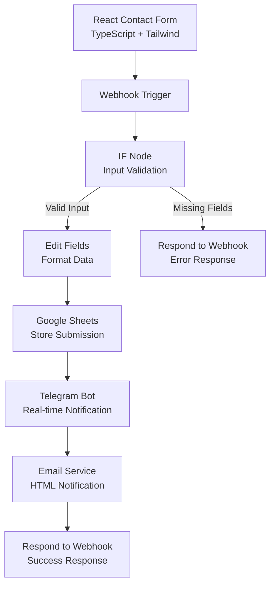

# FormFlow Automation


A **full-stack automation pipeline** that connects a React contact form with an **n8n workflow** to validate, store, and notify submissions in real time.

This project demonstrates how modern frontend applications can integrate with automation platforms to create **event-driven systems**.

---

# 🚀 Workflow Architecture



---

# 🛠 Tech Stack

## Frontend

- React
- TypeScript
- Tailwind CSS

## Automation

- n8n
- Webhooks

## Integrations

- Google Sheets
- Telegram Bot API
- Email Service

---

# ✨ Features

```
✔ Clean **React + TypeScript contact form**
✔ Reusable UI components
✔ Webhook-based automation trigger
✔ Input validation using **n8n IF node**
✔ Structured data transformation
✔ Automatic storage of form submissions
✔ Real-time **Telegram notifications**
✔ Automated **Email notifications**
✔ API response handling with **HTTP status codes**
✔ Error handling for missing fields
```

---

# 📌 How It Works

### 1️⃣ User submits the contact form

The React frontend collects:

- Name
- Email
- Message

---

### 2️⃣ Webhook Trigger

The form sends a **POST request** to an **n8n webhook endpoint**.

---

### 3️⃣ Input Validation

The workflow checks whether required fields exist.

If fields are missing the workflow returns:

```json
{
  "status": "error",
  "message": "Required fields missing"
}
```

HTTP Status Code:

```
400
```

---

### 4️⃣ Data Processing

Valid requests continue through the workflow.

The **Edit Fields node** formats incoming data before storing it.

---

### 5️⃣ Data Storage

Validated submissions are stored in **Google Sheets**.

---

### 6️⃣ Notifications

After storing the data:

- A **Telegram notification** is sent instantly
- A **formatted HTML email notification** is sent

---

### 7️⃣ API Response

Finally the workflow returns:

```json
{
  "status": "success",
  "message": "Form submitted successfully"
}
```

HTTP Status Code:

```
200
```

---

# 📽 Demo

Demo Video
https://drive.google.com/file/d/1kxIGh3PLSii68Og1Ebw8c-brV0VTHSiw/view?usp=sharing


---

# 📂 Project Structure

```
src/

├── components/
│   ├── ui/
│   │   ├── Input.tsx
│   │   ├── Spinner.tsx
│   │   └── Alert.tsx
│   │
│   └── ContactForm.tsx
│
├── services/
│   └── webhook.ts
│
├── types/
│   └── form.ts
```

---

# 📬 Example Telegram Notification

```
New Form Submission 🚀

Name: Aman Verma
Email: amanvermammb2005@gmail.com
Message: Hello from the contact form
```

---

# 📈 What This Project Demonstrates

This project demonstrates:

- Webhook-based event automation
- Integration between **frontend applications and automation tools**
- Workflow validation logic
- Data transformation pipelines
- Multi-channel notifications
- API error handling and response design

It showcases how **automation platforms like n8n can power backend workflows for modern applications**.

---

# 🧑‍💻 Author

**Aman Verma**

Full Stack Developer
React | TypeScript | Node.js | Automation
