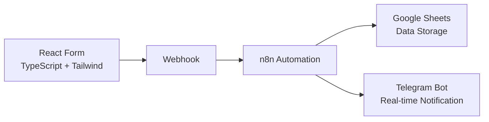
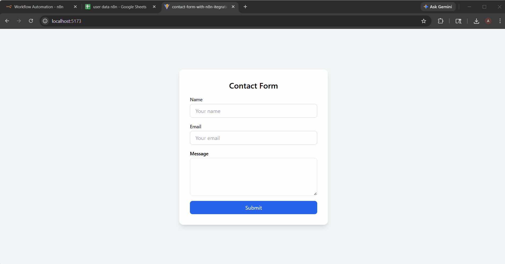

# FormFlow Automation

A simple automation pipeline that connects a React frontend form with an automation workflow using n8n.

The project demonstrates how form submissions can trigger automated processes such as storing data and sending real-time notifications.

## 🚀 Workflow Architecture

```
React Form (TypeScript + Tailwind)
↓
Webhook
↓
n8n Automation (Format Data + Timestamp)
↓
Google Sheets (Data Storage)
↓
Telegram Bot (Real-time Notification)
```

## 🚀 Workflow Architecture



## 🛠 Tech Stack

Frontend

- React
- TypeScript
- Tailwind CSS

Automation

- n8n
- Webhooks

Integrations

- Google Sheets
- Telegram Bot API

## ✨ Features

- Clean React + TypeScript contact form
- Reusable UI components
- Webhook-based automation trigger
- Automatic storage of form submissions
- Real-time Telegram notifications
- Simple automation workflow using n8n

## 📌 How It Works

1. User fills the contact form.
2. The form sends a POST request to an n8n webhook.
3. The workflow processes the request.
4. Form data is stored in Google Sheets.
5. A Telegram notification is sent instantly.

## 📽 Demo

Demo video: (https://drive.google.com/file/d/1s6vivxtjIvodnIl5cbGvwffYwoHdQbTh/view?usp=sharing)



## 📂 Project Structure

```
├── components/
│ ├── ui/
│ │ ├── Input.tsx
│ │ ├── Spinner.tsx
│ │ └── Alert.tsx
│ │
│ └── ContactForm.tsx
│
├── services/
│ └── webhook.ts
│
├── types/
│ └── form.ts
```

## 📬 Example Telegram Notification

New Form Submission 🚀

Name: Aman Verma  
Email: amanvermammb2005@gmail.com  
Message: Hello from the contact form
